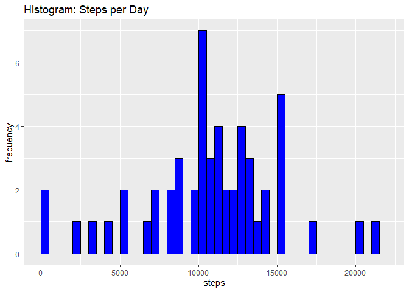
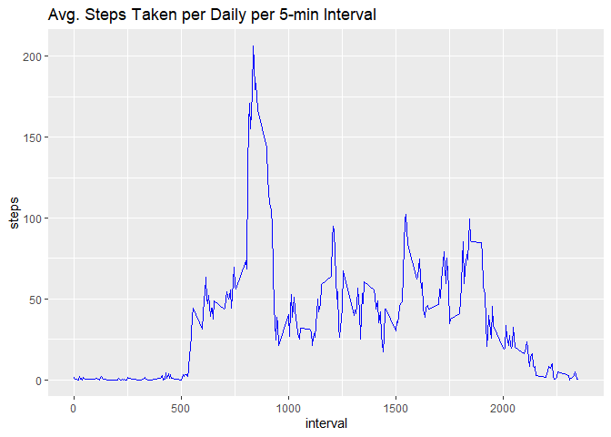
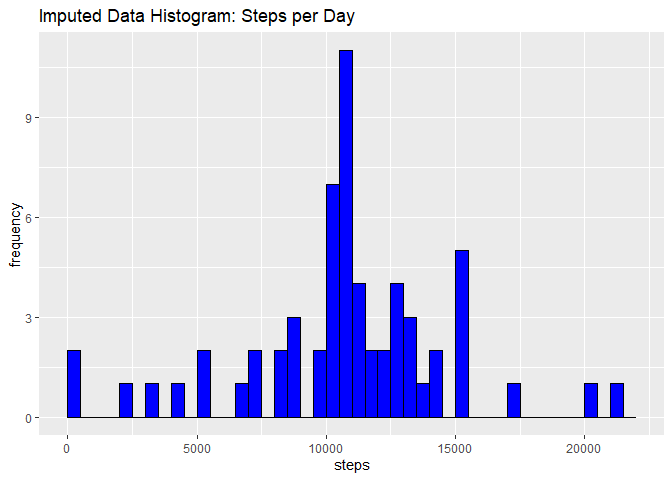
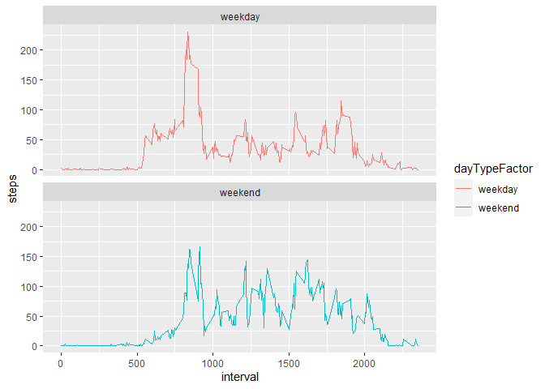

### Introduction
Data utilized for assignment consists of the number of steps taken by one individual at 5 min. intervals during the months of Oct and Nov 2012.

### Load and Preprocess Data
Set up markdown document: access packages, save file as .rmd and set global options for echo = True.

```r
library(knitr)
```

```
## Warning: package 'knitr' was built under R version 3.6.3
```

```r
opts_chunk$set(echo= TRUE, results= "hide")
library(ggplot2); library(lubridate); library(dplyr); library(UsingR)
```

```
## Warning: package 'lubridate' was built under R version 3.6.3
```

```
## 
## Attaching package: 'lubridate'
```

```
## The following objects are masked from 'package:base':
## 
##     date, intersect, setdiff, union
```

```
## Warning: package 'dplyr' was built under R version 3.6.3
```

```
## 
## Attaching package: 'dplyr'
```

```
## The following objects are masked from 'package:stats':
## 
##     filter, lag
```

```
## The following objects are masked from 'package:base':
## 
##     intersect, setdiff, setequal, union
```

```
## Warning: package 'UsingR' was built under R version 3.6.3
```

```
## Loading required package: MASS
```

```
## Warning: package 'MASS' was built under R version 3.6.3
```

```
## 
## Attaching package: 'MASS'
```

```
## The following object is masked from 'package:dplyr':
## 
##     select
```

```
## Loading required package: HistData
```

```
## Warning: package 'HistData' was built under R version 3.6.3
```

```
## Loading required package: Hmisc
```

```
## Warning: package 'Hmisc' was built under R version 3.6.3
```

```
## Loading required package: lattice
```

```
## Warning: package 'lattice' was built under R version 3.6.3
```

```
## Loading required package: survival
```

```
## Warning: package 'survival' was built under R version 3.6.3
```

```
## Loading required package: Formula
```

```
## Warning: package 'Formula' was built under R version 3.6.3
```

```
## 
## Attaching package: 'Hmisc'
```

```
## The following objects are masked from 'package:dplyr':
## 
##     src, summarize
```

```
## The following objects are masked from 'package:base':
## 
##     format.pval, units
```

```
## 
## Attaching package: 'UsingR'
```

```
## The following object is masked from 'package:survival':
## 
##     cancer
```
Load/read "activity" dataset; create data frame; and preprocess by formatting "date" column as a date.

```r
data.frame <- data.frame(read.csv("activity.csv", header = TRUE, sep = ',', colClasses = c("numeric", "character", "integer")))
data <- data.frame
str(data)
data$date <- ymd(data$date) #format as date
```

### What is the mean total number of steps taken per day? 
1. Obtaining Total number of steps taken per day after removing all rows where steps = NA  

```r
steps <- data$steps
dailyStepTotals <- data %>% filter (!is.na(steps)) %>% group_by(date) %>% summarise(steps = sum(steps))%>%
print(dailyStepTotals)
str(dailyStepTotals)
```

2. Histogram of total steps per day

```r
ggplot(data = dailyStepTotals, aes(x = steps)) + 
    geom_histogram(breaks=seq(0, 22000, by= 500), col = "black", fill = "blue") + 
    labs(title= "Histogram: Steps per Day", x = "steps", y = "frequency")
```

<!-- -->

3. Mean and median steps taken each day

```r
meanSteps <- mean(dailyStepTotals$steps, na.rm = TRUE)
medianSteps <- median(dailyStepTotals$steps, na.rm = TRUE)
meanSteps
medianSteps
```
  **Mean steps equal 10766.19 whereas median steps equal 10765.**

### What is the average daily activity pattern?
1. Time series plot of the 5 min. interval (x axis) and avg. number of steps taken, averaged across all days (y axis)

```r
interval <- data %>% filter (!is.na(steps)) %>% group_by(interval) %>% summarise(steps = mean(steps))%>%
print(interval) 

ggplot(interval, aes(x= interval, y=steps)) + geom_line(color="blue")+ labs(title= "Avg. Steps Taken per Daily per 5-min Interval")
```

<!-- -->

2. Which 5-min. interval, on average across all days, contains the maximum    number of steps?

```r
interval[which.max(interval$steps),]
```
  **Interval 835 contains the highest daily average for the maximum number of   steps at     206.**

### Imputing missing values
1. Calculate and report the total number of missing values in the dataset (# of rows w/ NAs)

```r
sum(is.na(data$steps)) #verifying absence of missing values
```
  **There are a total of 2304 rows of data (interval measurements) that contain NAs for the              number of steps.**

  2. Replacing missing values in steps column (NA) with the average for that five minute interval and   3. create data frame "avgInterval" with the new values.

```r
imputedData <- data.frame #creating "imputedData" data frame
NAs <- is.na(imputedData$steps) #identifying NAs in step column
avgInterval <- tapply(imputedData$steps, imputedData$interval, mean, na.rm=TRUE, simplify=TRUE) #create new value "avgInterval"
imputedData$steps[NAs] <- avgInterval[as.character(imputedData$interval[NAs])]
head(avgInterval)

sum(is.na(imputedData$steps)) #verifying absence of missing values
```

4. Histogram of total number of daily steps  
   Obtaining Total number of steps taken per day 

```r
imputedSteps <- imputedData$steps
imputedDailyStepTotals <- imputedData %>% filter (!is.na(steps)) %>% group_by(date) %>% summarise(steps = sum(steps))%>%
  print(imputedDailyStepTotals)
str(imputedDailyStepTotals)
```
  Creating histogram of imputed Data

```r
ggplot(data = imputedDailyStepTotals, aes(x = steps)) + 
  geom_histogram(breaks=seq(0, 22000, by= 500), col = "black", fill = "blue") + 
  labs(title= "Imputed Data Histogram: Steps per Day", x = "steps", y = "frequency")
```

<!-- -->
  
  Calculating the mean and median total number of steps for the ImputedData

```r
imputedMeanSteps <- mean(imputedDailyStepTotals$steps, na.rm = TRUE)
imputedMedianSteps <- median(imputedDailyStepTotals$steps, na.rm = TRUE)
imputedMeanSteps
imputedMedianSteps
```
 **The mean and median for the imputed data are equal at 10766.19. The mean for the data                prior to filling in missing values also equaled 10766.19 whereas the median prior to                 imputation was 10765 (difference of 1.19).Imputing data resulted in a minimal increase to the        median in the imputed data.**

### Are there differences in activity patterns between weekdays and weekends?
  1. Utilizing the imputedData to create a new factor variable dayType to identify if date
     is a weekday or weekend by coding days beginning with S as weekend and all others 
     as weekday. 

```r
imputedData$date <- ymd(imputedData$date) #format as date
imputedData

dayType <- ifelse(weekdays(imputedData$date) %in% c("Saturday", "Sunday"), "weekend", "weekday") #create new variable "dayType"
summary(dayType) #shows "dayType" class as character

dayTypeFactor <- factor(x= dayType) #change "dayType" to factor variable
levels(dayTypeFactor) #checking the factor levels
table(dayTypeFactor) #creating table to view factor totals
head(imputedData)
```
  **There are a total of 12960 weekday records and 4608 weekend records.**

  Adding column called "dayTypeFactor" to data frame "imputedData".

```r
imputedDataFactor <- cbind(imputedData, dayTypeFactor) #add new column "dayTypeFactor"
imputedDataFactor #view new data frame
```

  2.Create a panel plot containing a time series plot of the 5 min. interval (x axis) and 
    avg. number of steps taken, averaged across all weekdays or weekend days (y axis).

```r
intervalImputed <- imputedDataFactor %>% group_by(interval, dayTypeFactor) %>% 
summarise(steps = mean(steps))%>%
print(intervalImputed)
```

```
## `summarise()` has grouped output by 'interval'. You can override using the `.groups` argument.
```

```r
dayTypePanelPlot <- ggplot(intervalImputed, aes(x=interval, y=steps, color = dayTypeFactor))+
  geom_line() + facet_wrap(~dayTypeFactor, ncol = 1, nrow=2)
print(dayTypePanelPlot)
```

<!-- -->

  **Results indicate an increase in activity patterns on the weekends as opposed to the weekdays.        Activity during the early part of the day is highest on the week days.** 
